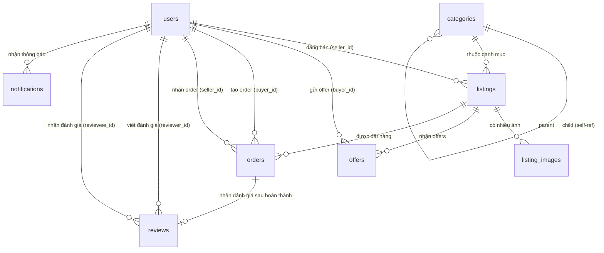

# 📦 ReMarket — Thiết kế Database Chi tiết

> **Version:** 3.0 | **Ngày cập nhật:** 2026-03-14
> **Database:** PostgreSQL 15+
> **ORM:** SQLModel + SQLAlchemy

---

## Mục lục

1. [Tổng quan Database](#1-tổng-quan-database)
2. [ERD — Entity Relationship Diagram](#2-erd)
3. [Chi tiết Từng Bảng](#3-chi-tiết-từng-bảng)
4. [Thứ tự Migration](#4-thứ-tự-migration)
5. [Index Strategy](#5-index-strategy)
6. [Enum Values Reference](#6-enum-values-reference)

---

## 1. Tổng quan Database

### 1.1 Số lượng bảng: 8

| Nhóm               | Bảng                                | Mục đích                          |
| ------------------ | ----------------------------------- | --------------------------------- |
| **Auth & User**    | `users`                             | Đăng nhập, profile, địa chỉ tích hợp |
| **Catalog**        | `categories`                        | Danh mục đồ cũ (cây phân cấp)    |
| **Listing**        | `listings`, `listing_images`        | Tin đăng bán + ảnh                |
| **Bargaining**     | `offers`                            | Thương lượng giá                  |
| **Order & Trust**  | `orders`, `reviews`                 | Đơn hàng + đánh giá               |
| **System**         | `notifications`                     | Thông báo in-app                  |

### 1.2 Quy ước chung

- **Primary Key:** UUID (`gen_random_uuid()`)
- **Timestamps:** Dùng `TIMESTAMPTZ` (timezone-aware), mặc định `NOW()`
- **Soft delete:** Dùng `is_active` / `status` thay vì xóa hard
- **Naming:** snake_case, số ít cho tên bảng
- **Auth Token:** Refresh token được lưu hash trực tiếp trong bảng `users` (`hashed_refresh_token`)

---

## 2. ERD



### Dependency Graph (Thứ tự tạo bảng)

```
Level 0 (Không phụ thuộc):
  └── users
  └── categories

Level 1 (Phụ thuộc Level 0):
  └── listings            → users, categories
  └── notifications       → users
  └── categories (self)   → categories (parent_id)

Level 2 (Phụ thuộc Level 1):
  └── listing_images      → listings
  └── offers              → listings, users
  └── orders              → users, listings

Level 3 (Phụ thuộc Level 2):
  └── reviews             → orders, users
```

---

## 3. Chi tiết Từng Bảng

### 3.1 `users` — Người dùng

> **Module:** Auth, Profile | **Quan hệ:** 1 user → N listings, N offers, N orders

| Cột                    | Kiểu           | Constraints                     | Mô tả                              |
| ---------------------- | -------------- | ------------------------------- | ---------------------------------- |
| `id`                   | `UUID`         | PK, default `gen_random_uuid()` | ID duy nhất                        |
| `email`                | `VARCHAR(255)` | NOT NULL, UNIQUE                | Email đăng nhập                    |
| `phone`                | `VARCHAR(20)`  | —                               | Số điện thoại                      |
| `password_hash`        | `VARCHAR(255)` | NOT NULL                        | Hash password (bcrypt)             |
| `full_name`            | `VARCHAR(255)` | NOT NULL                        | Họ tên hiển thị                    |
| `avatar_url`           | `TEXT`         | —                               | URL ảnh đại diện                   |
| `bio`                  | `TEXT`         | —                               | Giới thiệu bản thân                |
| `province`             | `VARCHAR(100)` | —                               | Tỉnh/Thành phố                     |
| `district`             | `VARCHAR(100)` | —                               | Quận/Huyện                         |
| `ward`                 | `VARCHAR(100)` | —                               | Phường/Xã                          |
| `address_detail`       | `VARCHAR(255)` | —                               | Số nhà, tên đường                  |
| `is_phone_verified`    | `BOOLEAN`      | DEFAULT FALSE                   | SĐT đã xác thực?                   |
| `is_email_verified`    | `BOOLEAN`      | DEFAULT FALSE                   | Email đã xác thực?                 |
| `trust_score`          | `DECIMAL(5,1)` | DEFAULT 0.0                     | Điểm tin cậy tổng hợp              |
| `rating_avg`           | `DECIMAL(3,2)` | DEFAULT 0.00                    | Rating trung bình (1.00 - 5.00)    |
| `rating_count`         | `INT`          | DEFAULT 0                       | Tổng số lượt đánh giá              |
| `completed_orders`     | `INT`          | DEFAULT 0                       | Số đơn hoàn thành                  |
| `role`                 | `VARCHAR(20)`  | DEFAULT 'user'                  | `user` \| `admin`                  |
| `is_active`            | `BOOLEAN`      | DEFAULT TRUE                    | Tài khoản còn hoạt động?           |
| `hashed_refresh_token` | `VARCHAR(255)` | —                               | Hash of refresh token hiện tại     |
| `created_at`           | `TIMESTAMPTZ`  | DEFAULT NOW()                   | Ngày tạo                           |
| `updated_at`           | `TIMESTAMPTZ`  | DEFAULT NOW()                   | Ngày cập nhật                      |

> [!NOTE]
> Địa chỉ (`province`, `district`, `ward`, `address_detail`) được tích hợp trực tiếp trong `users` thay vì bảng riêng. `hashed_refresh_token` thay thế bảng `refresh_tokens` riêng — 1 user chỉ có 1 refresh token active tại 1 thời điểm.

**SQL:**

```sql
CREATE TABLE users (
    id UUID PRIMARY KEY DEFAULT gen_random_uuid(),
    email VARCHAR(255) NOT NULL UNIQUE,
    phone VARCHAR(20),
    password_hash VARCHAR(255) NOT NULL,
    full_name VARCHAR(255) NOT NULL,
    avatar_url TEXT,
    bio TEXT,
    province VARCHAR(100),
    district VARCHAR(100),
    ward VARCHAR(100),
    address_detail VARCHAR(255),
    is_phone_verified BOOLEAN DEFAULT FALSE,
    is_email_verified BOOLEAN DEFAULT FALSE,
    trust_score DECIMAL(5,1) DEFAULT 0.0,
    rating_avg DECIMAL(3,2) DEFAULT 0.00,
    rating_count INT DEFAULT 0,
    completed_orders INT DEFAULT 0,
    role VARCHAR(20) DEFAULT 'user',
    is_active BOOLEAN DEFAULT TRUE,
    hashed_refresh_token VARCHAR(255),
    created_at TIMESTAMPTZ DEFAULT NOW(),
    updated_at TIMESTAMPTZ DEFAULT NOW()
);

CREATE INDEX idx_users_email ON users(email);
CREATE INDEX idx_users_role ON users(role);
```

---

### 3.2 `categories` — Danh mục (Cây phân cấp)

> **Module:** Listings | **Quan hệ:** self-referencing (parent → child)

| Cột         | Kiểu           | Constraints                   | Mô tả               |
| ----------- | -------------- | ----------------------------- | ------------------- |
| `id`        | `UUID`         | PK                            | —                   |
| `parent_id` | `UUID`         | FK → categories(id), NULLABLE | NULL = danh mục gốc |
| `name`      | `VARCHAR(255)` | NOT NULL                      | Tên danh mục        |
| `slug`      | `VARCHAR(255)` | NOT NULL, UNIQUE              | URL-friendly slug   |
| `icon_url`  | `TEXT`         | —                             | URL icon            |
| `created_at`| `TIMESTAMPTZ`  | DEFAULT NOW()                 | —                   |

**SQL:**

```sql
CREATE TABLE categories (
    id UUID PRIMARY KEY DEFAULT gen_random_uuid(),
    parent_id UUID REFERENCES categories(id) ON DELETE SET NULL,
    name VARCHAR(255) NOT NULL,
    slug VARCHAR(255) NOT NULL UNIQUE,
    icon_url TEXT,
    created_at TIMESTAMPTZ DEFAULT NOW()
);
```

**Seed data mẫu (Cấp 1):**

| slug         | name                |
| ------------ | ------------------- |
| `dien-tu`    | Điện tử & Công nghệ |
| `thoi-trang` | Thời trang          |
| `gia-dung`   | Đồ gia dụng         |
| `xe-co`      | Xe cộ               |
| `sach`       | Sách & Học liệu     |
| `the-thao`   | Đồ thể thao         |
| `noi-that`   | Nội thất            |
| `khac`       | Khác                |

---

### 3.3 `listings` — Tin đăng bán ⭐ (Bảng cốt lõi)

> **Module:** Listings | **Quan hệ:** N listings → 1 user (seller), 1 category

| Cột               | Kiểu            | Constraints                   | Mô tả                |
| ----------------- | --------------- | ----------------------------- | -------------------- |
| `id`              | `UUID`          | PK                            | —                    |
| `seller_id`       | `UUID`          | FK → users(id), NOT NULL      | Người bán            |
| `category_id`     | `UUID`          | FK → categories(id), NOT NULL | Danh mục             |
| `title`           | `VARCHAR(500)`  | NOT NULL                      | Tiêu đề tin          |
| `description`     | `TEXT`          | —                             | Mô tả chi tiết       |
| `price`           | `DECIMAL(15,2)` | NOT NULL                      | Giá mong muốn        |
| `is_negotiable`   | `BOOLEAN`       | DEFAULT TRUE                  | Cho phép trả giá?    |
| `condition_grade` | `VARCHAR(20)`   | NOT NULL                      | Tình trạng đồ cũ     |
| `status`          | `VARCHAR(20)`   | DEFAULT 'pending'             | Trạng thái tin       |
| `created_at`      | `TIMESTAMPTZ`   | DEFAULT NOW()                 | —                    |
| `updated_at`      | `TIMESTAMPTZ`   | DEFAULT NOW()                 | —                    |

> [!IMPORTANT]
> **condition_grade values:** `brand_new`, `like_new`, `good`, `fair`, `poor`
> **status values:** `pending`, `active`, `sold`, `hidden`, `rejected`

**SQL:**

```sql
CREATE TABLE listings (
    id UUID PRIMARY KEY DEFAULT gen_random_uuid(),
    seller_id UUID NOT NULL REFERENCES users(id) ON DELETE CASCADE,
    category_id UUID NOT NULL REFERENCES categories(id),
    title VARCHAR(500) NOT NULL,
    description TEXT,
    price DECIMAL(15,2) NOT NULL,
    is_negotiable BOOLEAN DEFAULT TRUE,
    condition_grade VARCHAR(20) NOT NULL,
    status VARCHAR(20) DEFAULT 'pending',
    created_at TIMESTAMPTZ DEFAULT NOW(),
    updated_at TIMESTAMPTZ DEFAULT NOW()
);

CREATE INDEX idx_listings_seller ON listings(seller_id);
CREATE INDEX idx_listings_category ON listings(category_id);
CREATE INDEX idx_listings_status ON listings(status);
```

---

### 3.4 `listing_images` — Ảnh sản phẩm

> **Module:** Listings | **Quan hệ:** N images → 1 listing

| Cột          | Kiểu          | Constraints                          | Mô tả          |
| ------------ | ------------- | ------------------------------------ | -------------- |
| `id`         | `UUID`        | PK                                   | —              |
| `listing_id` | `UUID`        | FK → listings(id), ON DELETE CASCADE | —              |
| `image_url`  | `TEXT`        | NOT NULL                             | URL ảnh        |
| `is_primary` | `BOOLEAN`     | DEFAULT FALSE                        | Ảnh đại diện?  |
| `created_at` | `TIMESTAMPTZ` | DEFAULT NOW()                        | —              |

**SQL:**

```sql
CREATE TABLE listing_images (
    id UUID PRIMARY KEY DEFAULT gen_random_uuid(),
    listing_id UUID NOT NULL REFERENCES listings(id) ON DELETE CASCADE,
    image_url TEXT NOT NULL,
    is_primary BOOLEAN DEFAULT FALSE,
    created_at TIMESTAMPTZ DEFAULT NOW()
);

CREATE INDEX idx_listing_images_listing ON listing_images(listing_id);
```

---

### 3.5 `offers` — Thương lượng giá ⭐

> **Module:** Bargaining | **Quan hệ:** N offers → 1 listing, 1 buyer

| Cột           | Kiểu            | Constraints                          | Mô tả                                             |
| ------------- | --------------- | ------------------------------------ | ------------------------------------------------- |
| `id`          | `UUID`          | PK                                   | —                                                 |
| `listing_id`  | `UUID`          | FK → listings(id), ON DELETE CASCADE | Tin đăng được trả giá                             |
| `buyer_id`    | `UUID`          | FK → users(id), ON DELETE CASCADE    | Người trả giá                                     |
| `offer_price` | `DECIMAL(15,2)` | NOT NULL                             | Giá đề xuất                                       |
| `status`      | `VARCHAR(20)`   | DEFAULT 'pending'                    | `pending`, `accepted`, `rejected`, `countered`, `expired` |
| `created_at`  | `TIMESTAMPTZ`   | DEFAULT NOW()                        | —                                                 |
| `updated_at`  | `TIMESTAMPTZ`   | DEFAULT NOW()                        | —                                                 |

**SQL:**

```sql
CREATE TABLE offers (
    id UUID PRIMARY KEY DEFAULT gen_random_uuid(),
    listing_id UUID NOT NULL REFERENCES listings(id) ON DELETE CASCADE,
    buyer_id UUID NOT NULL REFERENCES users(id) ON DELETE CASCADE,
    offer_price DECIMAL(15,2) NOT NULL,
    status VARCHAR(20) DEFAULT 'pending',
    created_at TIMESTAMPTZ DEFAULT NOW(),
    updated_at TIMESTAMPTZ DEFAULT NOW()
);

CREATE INDEX idx_offers_listing ON offers(listing_id);
CREATE INDEX idx_offers_buyer ON offers(buyer_id);
```

---

### 3.6 `orders` — Đơn hàng

> **Module:** Orders | **Quan hệ:** 1 order → 1 buyer, 1 seller, 1 listing

| Cột           | Kiểu            | Constraints                 | Mô tả              |
| ------------- | --------------- | --------------------------- | ------------------ |
| `id`          | `UUID`          | PK                          | —                  |
| `buyer_id`    | `UUID`          | FK → users(id), NOT NULL    | —                  |
| `seller_id`   | `UUID`          | FK → users(id), NOT NULL    | —                  |
| `listing_id`  | `UUID`          | FK → listings(id), NOT NULL | —                  |
| `final_price` | `DECIMAL(15,2)` | NOT NULL                    | Giá chốt cuối cùng |
| `status`      | `VARCHAR(20)`   | DEFAULT 'pending'           | Trạng thái đơn     |
| `created_at`  | `TIMESTAMPTZ`   | DEFAULT NOW()               | —                  |
| `updated_at`  | `TIMESTAMPTZ`   | DEFAULT NOW()               | —                  |

> **status values:** `pending`, `completed`, `cancelled`

**SQL:**

```sql
CREATE TABLE orders (
    id UUID PRIMARY KEY DEFAULT gen_random_uuid(),
    buyer_id UUID NOT NULL REFERENCES users(id),
    seller_id UUID NOT NULL REFERENCES users(id),
    listing_id UUID NOT NULL REFERENCES listings(id),
    final_price DECIMAL(15,2) NOT NULL,
    status VARCHAR(20) DEFAULT 'pending',
    created_at TIMESTAMPTZ DEFAULT NOW(),
    updated_at TIMESTAMPTZ DEFAULT NOW()
);

CREATE INDEX idx_orders_buyer ON orders(buyer_id);
CREATE INDEX idx_orders_seller ON orders(seller_id);
CREATE INDEX idx_orders_listing ON orders(listing_id);
```

---

### 3.7 `reviews` — Đánh giá sau giao dịch

> **Module:** Trust | **Quan hệ:** 1 review → 1 order (UNIQUE), 1 reviewer, 1 reviewee

| Cột           | Kiểu          | Constraints                        | Mô tả                        |
| ------------- | ------------- | ---------------------------------- | ---------------------------- |
| `id`          | `UUID`        | PK                                 | —                            |
| `order_id`    | `UUID`        | FK → orders(id), UNIQUE, NOT NULL  | 1 order → 1 review           |
| `reviewer_id` | `UUID`        | FK → users(id), NOT NULL           | Người đánh giá (buyer)       |
| `reviewee_id` | `UUID`        | FK → users(id), NOT NULL           | Người được đánh giá (seller) |
| `rating`      | `INT`         | NOT NULL, CHECK (1-5)              | Số sao                       |
| `comment`     | `TEXT`        | —                                  | Nhận xét                     |
| `created_at`  | `TIMESTAMPTZ` | DEFAULT NOW()                      | —                            |

> [!NOTE]
> **Business Rules:**
>
> - Chỉ review được sau khi order `status` = `completed`
> - 1 order chỉ 1 review (buyer → seller)
> - Sau khi review → cập nhật `users.rating_avg` và `users.rating_count`

**SQL:**

```sql
CREATE TABLE reviews (
    id UUID PRIMARY KEY DEFAULT gen_random_uuid(),
    order_id UUID NOT NULL UNIQUE REFERENCES orders(id) ON DELETE CASCADE,
    reviewer_id UUID NOT NULL REFERENCES users(id),
    reviewee_id UUID NOT NULL REFERENCES users(id),
    rating INT NOT NULL CHECK (rating >= 1 AND rating <= 5),
    comment TEXT,
    created_at TIMESTAMPTZ DEFAULT NOW()
);

CREATE INDEX idx_reviews_reviewer ON reviews(reviewer_id);
CREATE INDEX idx_reviews_reviewee ON reviews(reviewee_id);
```

---

### 3.8 `notifications` — Thông báo in-app

> **Module:** Notifications | **Quan hệ:** N notifications → 1 user

| Cột          | Kiểu           | Constraints                       | Mô tả                                  |
| ------------ | -------------- | --------------------------------- | -------------------------------------- |
| `id`         | `UUID`         | PK                                | —                                      |
| `user_id`    | `UUID`         | FK → users(id), ON DELETE CASCADE | Người nhận thông báo                   |
| `type`       | `VARCHAR(50)`  | NOT NULL                          | Loại thông báo (xem danh sách bên dưới)|
| `title`      | `VARCHAR(255)` | NOT NULL                          | Tiêu đề ngắn                           |
| `message`    | `TEXT`         | NOT NULL                          | Nội dung thông báo                     |
| `data`       | `JSONB`        | DEFAULT '{}'                      | Dữ liệu kèm (listing_id, order_id...)  |
| `is_read`    | `BOOLEAN`      | DEFAULT FALSE                     | Đã đọc?                               |
| `created_at` | `TIMESTAMPTZ`  | DEFAULT NOW()                     | —                                      |

**Notification Types:**

```
offer_received | offer_accepted | offer_rejected | offer_countered | offer_expired
order_created  | order_completed | order_cancelled
listing_approved | listing_rejected
review_received
```

**SQL:**

```sql
CREATE TABLE notifications (
    id UUID PRIMARY KEY DEFAULT gen_random_uuid(),
    user_id UUID NOT NULL REFERENCES users(id) ON DELETE CASCADE,
    type VARCHAR(50) NOT NULL,
    title VARCHAR(255) NOT NULL,
    message TEXT NOT NULL,
    data JSONB DEFAULT '{}',
    is_read BOOLEAN DEFAULT FALSE,
    created_at TIMESTAMPTZ DEFAULT NOW()
);

CREATE INDEX idx_notifications_user ON notifications(user_id);
CREATE INDEX idx_notifications_unread ON notifications(user_id, is_read) WHERE is_read = FALSE;
```

---

## 4. Thứ tự Migration

> Thứ tự này đảm bảo FK constraints không bị lỗi

| Thứ tự | Migration file                      | Bảng             | Ghi chú                      |
| ------ | ----------------------------------- | ---------------- | ---------------------------- |
| 001    | `001_create_users.sql`              | `users`          | Bảng gốc, không FK           |
| 002    | `002_create_categories.sql`         | `categories`     | Self-ref FK + seed data      |
| 003    | `003_create_listings.sql`           | `listings`       | FK → users, categories       |
| 004    | `004_create_listing_images.sql`     | `listing_images` | FK → listings                |
| 005    | `005_create_offers.sql`             | `offers`         | FK → listings, users         |
| 006    | `006_create_orders.sql`             | `orders`         | FK → users, listings         |
| 007    | `007_create_reviews.sql`            | `reviews`        | FK → orders, users           |
| 008    | `008_create_notifications.sql`      | `notifications`  | FK → users                   |

---

## 5. Index Strategy

### 5.1 Index tổng hợp

| Bảng            | Index                | Loại           | Mục đích                    |
| --------------- | -------------------- | -------------- | --------------------------- |
| `users`         | `email`              | Unique         | Đăng nhập                   |
| `users`         | `role`               | B-tree         | Filter admin/user           |
| `listings`      | `seller_id`          | B-tree         | Tin của tôi                 |
| `listings`      | `category_id`        | B-tree         | Filter theo danh mục        |
| `listings`      | `status`             | B-tree         | Filter listings active      |
| `offers`        | `listing_id`         | B-tree         | Offers của 1 listing        |
| `offers`        | `buyer_id`           | B-tree         | Offers tôi đã gửi          |
| `orders`        | `buyer_id`           | B-tree         | Đơn hàng tôi đã mua        |
| `orders`        | `seller_id`          | B-tree         | Đơn hàng tôi đã bán        |
| `orders`        | `listing_id`         | B-tree         | Đơn hàng của listing        |
| `reviews`       | `reviewer_id`        | B-tree         | Đánh giá tôi đã viết       |
| `reviews`       | `reviewee_id`        | B-tree         | Đánh giá nhận được          |
| `notifications` | `user_id`            | B-tree         | Thông báo của user          |
| `notifications` | `user_id + is_read`  | Partial (FALSE)| Thông báo chưa đọc          |

---

## 6. Enum Values Reference

### 6.1 Bảng tổng hợp Enum/Status

| Bảng       | Cột               | Giá trị                                              |
| ---------- | ----------------- | ---------------------------------------------------- |
| `users`    | `role`            | `user`, `admin`                                      |
| `listings` | `status`          | `pending`, `active`, `sold`, `hidden`, `rejected`    |
| `listings` | `condition_grade` | `brand_new`, `like_new`, `good`, `fair`, `poor`      |
| `offers`   | `status`          | `pending`, `accepted`, `rejected`, `countered`, `expired` |
| `orders`   | `status`          | `pending`, `completed`, `cancelled`                  |

### 6.2 Python Enum Classes

```python
# app/models/enums.py
from enum import Enum

class UserRole(str, Enum):
    USER = "user"
    ADMIN = "admin"

class ListingStatus(str, Enum):
    PENDING = "pending"
    ACTIVE = "active"
    SOLD = "sold"
    HIDDEN = "hidden"
    REJECTED = "rejected"

class ConditionGrade(str, Enum):
    BRAND_NEW = "brand_new"
    LIKE_NEW = "like_new"
    GOOD = "good"
    FAIR = "fair"
    POOR = "poor"

class OfferStatus(str, Enum):
    PENDING = "pending"
    ACCEPTED = "accepted"
    REJECTED = "rejected"
    COUNTERED = "countered"
    EXPIRED = "expired"

class OrderStatus(str, Enum):
    PENDING = "pending"
    COMPLETED = "completed"
    CANCELLED = "cancelled"
```

---

> **Tài liệu liên quan:**
>
> - `02-module-design.md` — Thiết kế Module chi tiết
> - `03-implementation-order.md` — Thứ tự thi công
