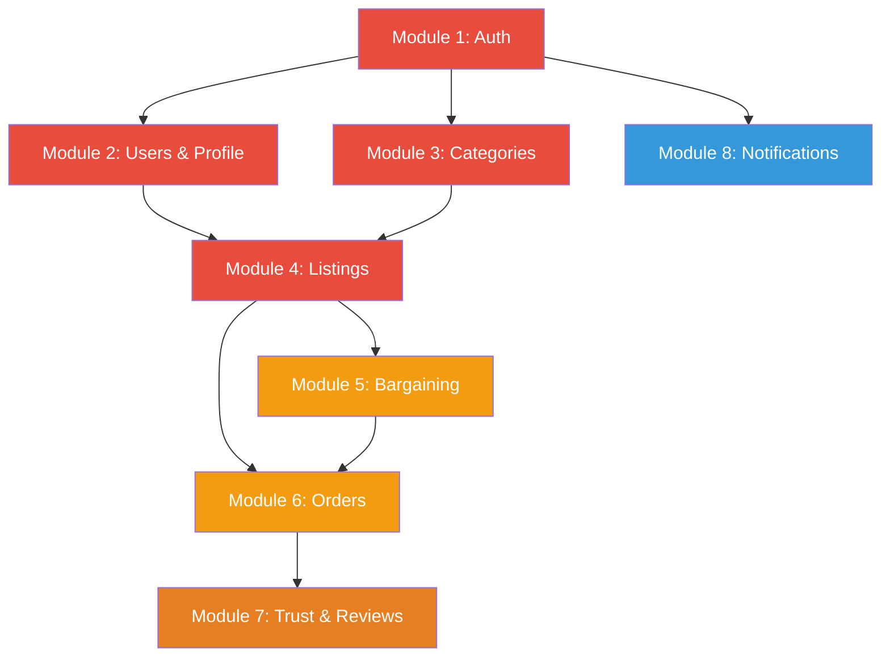
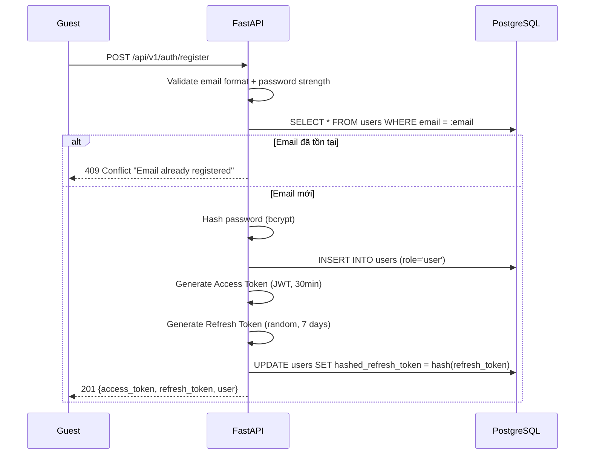
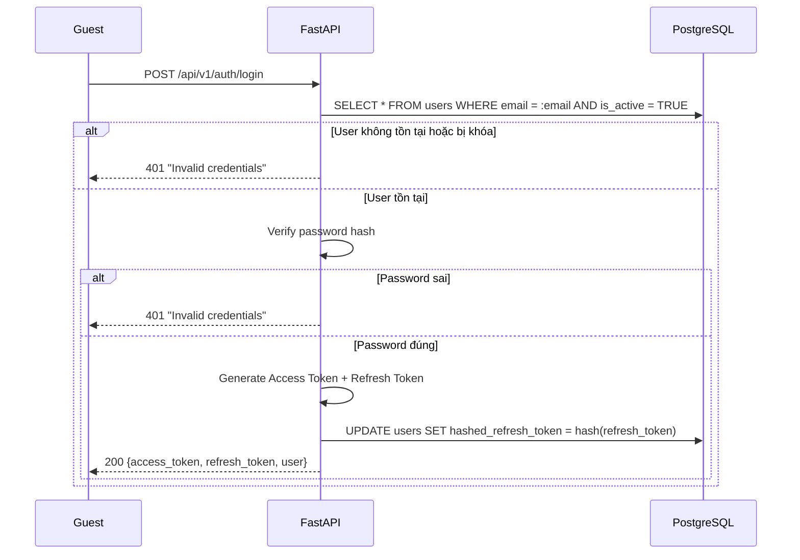
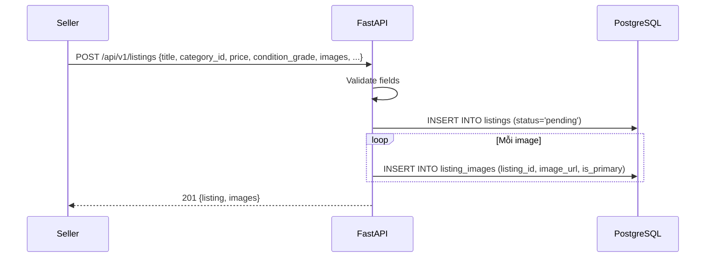
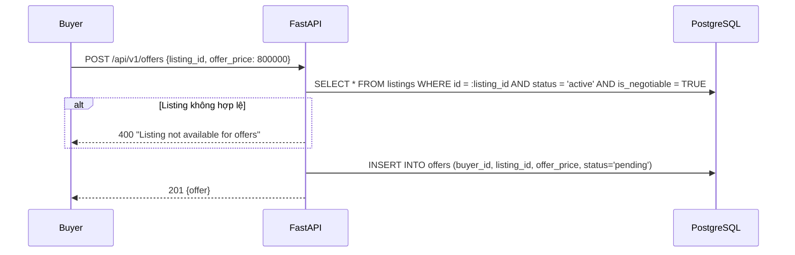
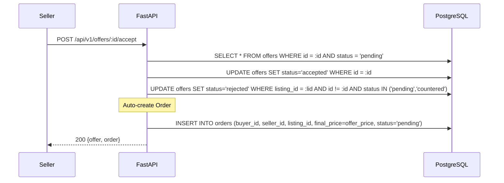
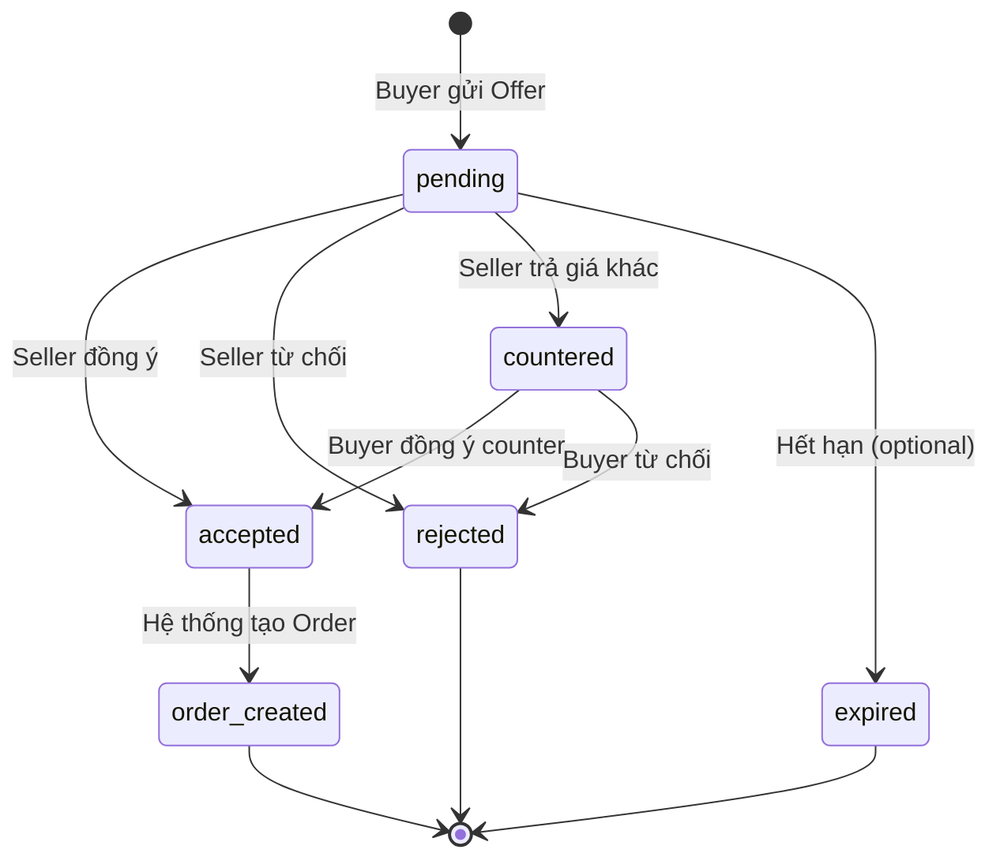
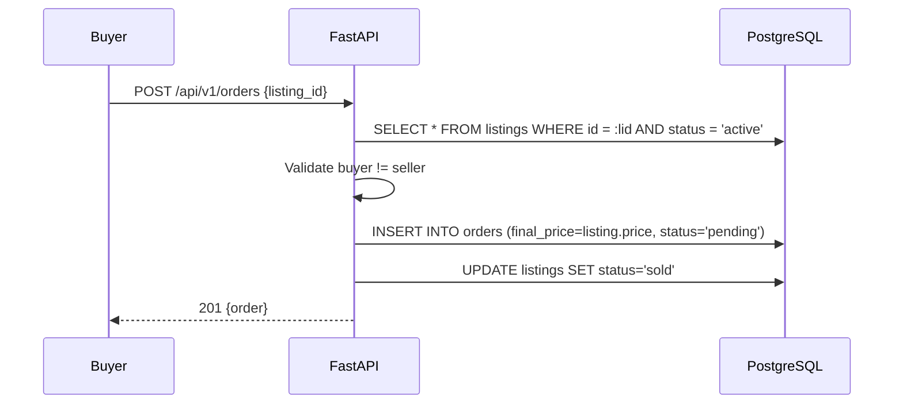
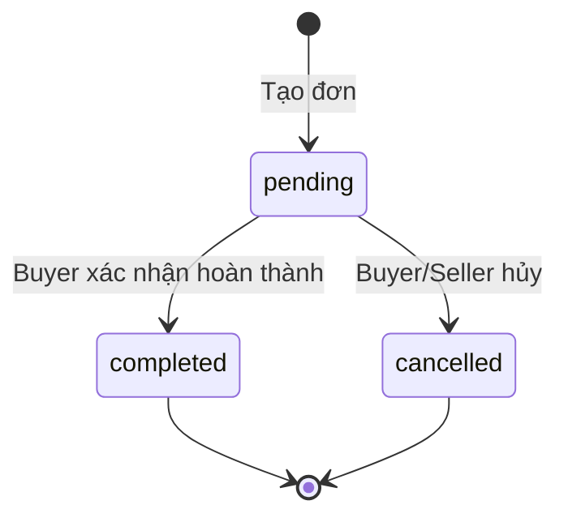
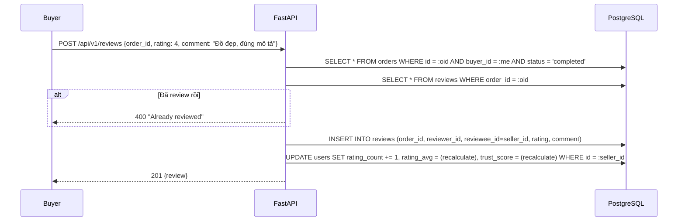

# 🧩 ReMarket — Thiết kế Module Chi tiết

> **Version:** 3.0 | **Ngày cập nhật:** 2026-03-14
> **Tổng module:** 8 (7 core + 1 hỗ trợ)
> **Ưu tiên:** BE trước, FE sau

---

## Mục lục

1. [Tổng quan Module & Thứ tự Ưu tiên](#1-tổng-quan)
2. [Module Auth (JWT)](#module-1-auth)
3. [Module Users & Profile](#module-2-users--profile)
4. [Module Categories](#module-3-categories)
5. [Module Listings](#module-4-listings)
6. [Module Bargaining (Offers)](#module-5-bargaining-offers)
7. [Module Orders](#module-6-orders)
8. [Module Trust & Reviews](#module-7-trust--reviews)
9. [Module Notifications](#module-8-notifications)
10. [Ma trận Module ↔ Database](#10-ma-trận-module--database)

---

## 1. Tổng quan

### 1.1 Danh sách Module theo Thứ tự Ưu tiên

| #   | Module                  | Loại    |  Độ ưu tiên   | Phụ thuộc              | DB Tables                     |
| --- | ----------------------- | ------- | :-----------: | ---------------------- | ----------------------------- |
| 1   | **Auth (JWT)**          | Hỗ trợ  |  🔴 Cao nhất  | —                      | `users`                       |
| 2   | **Users & Profile**     | Hỗ trợ  |    🔴 Cao     | Auth                   | `users`                       |
| 3   | **Categories**          | Hỗ trợ  |    🔴 Cao     | Auth (admin)           | `categories`                  |
| 4   | **Listings**            | Core ⭐ |    🔴 Cao     | Auth, Users, Categories| `listings`, `listing_images`  |
| 5   | **Bargaining (Offers)** | Core ⭐ | 🟡 Trung bình | Listings, Auth         | `offers`                      |
| 6   | **Orders**              | Core ⭐ | 🟡 Trung bình | Listings, Offers       | `orders`                      |
| 7   | **Trust & Reviews**     | Core ⭐ |  🟠 Sau cùng  | Orders                 | `reviews`                     |
| 8   | **Notifications**       | Hỗ trợ  | 🔵 Xuyên suốt | Auth                   | `notifications`               |

### 1.2 Biểu đồ Phụ thuộc Module



---

## Module 1: Auth

### Tác nhân

| Actor      | Hành động                  |
| ---------- | -------------------------- |
| **Guest**  | Đăng ký, đăng nhập         |
| **User**   | Refresh token, đăng xuất   |
| **System** | Validate JWT, revoke token |

### Use Cases

#### UC-1.1: Đăng ký tài khoản

| Mục               | Chi tiết                                             |
| ----------------- | ---------------------------------------------------- |
| **Actor**         | Guest                                                |
| **Precondition**  | Chưa có tài khoản với email này                      |
| **Input**         | `email`, `password`, `full_name`, `phone` (optional) |
| **Postcondition** | User được tạo + nhận cặp token                       |

**Luồng hoạt động:**



**DB tương tác:** `users` (INSERT, UPDATE `hashed_refresh_token`)

#### UC-1.2: Đăng nhập

| Mục               | Chi tiết                         |
| ----------------- | -------------------------------- |
| **Actor**         | Guest                            |
| **Precondition**  | Có tài khoản, `is_active = TRUE` |
| **Input**         | `email`, `password`              |
| **Postcondition** | Nhận cặp token mới               |

**Luồng hoạt động:**



**DB tương tác:** `users` (SELECT, UPDATE `hashed_refresh_token`)

#### UC-1.3: Refresh Token

| Mục               | Chi tiết                                                    |
| ----------------- | ----------------------------------------------------------- |
| **Actor**         | User (access token hết hạn)                                 |
| **Input**         | `refresh_token`                                             |
| **Postcondition** | Nhận access_token mới, refresh_token mới (rotation)         |

**DB tương tác:** `users` (SELECT verify `hashed_refresh_token`, UPDATE với token mới)

#### UC-1.4: Đăng xuất

| Mục               | Chi tiết                          |
| ----------------- | --------------------------------- |
| **Actor**         | User                              |
| **Input**         | `refresh_token`                   |
| **Postcondition** | `hashed_refresh_token` = NULL     |

**DB tương tác:** `users` (UPDATE `hashed_refresh_token = NULL`)

### API Endpoints

| Method | Endpoint                | Auth | Mô tả                    |
| ------ | ----------------------- | :--: | ------------------------ |
| POST   | `/api/v1/auth/register` |  ❌  | Đăng ký                  |
| POST   | `/api/v1/auth/login`    |  ❌  | Đăng nhập                |
| POST   | `/api/v1/auth/refresh`  |  ❌  | Refresh token            |
| POST   | `/api/v1/auth/logout`   |  ✅  | Đăng xuất (revoke token) |

### Business Rules

> [!IMPORTANT]
>
> - Password tối thiểu 8 ký tự, phải có chữ hoa + chữ thường + số
> - Access Token: JWT HS256, TTL = 30 phút
> - Refresh Token: random string, TTL = 7 ngày, lưu hash SHA-256 trong `users.hashed_refresh_token`
> - Refresh Token **Rotation**: mỗi lần refresh → token cũ revoke, tạo token mới
> - 1 user chỉ có 1 refresh token active tại 1 thời điểm
> - Rate limit: 5 lần đăng nhập sai / 15 phút / IP

---

## Module 2: Users & Profile

### Tác nhân

| Actor     | Hành động                       |
| --------- | ------------------------------- |
| **User**  | Xem/sửa profile, cập nhật địa chỉ |
| **Guest** | Xem profile public của user khác|
| **Admin** | Xem/ban user                    |

### Use Cases

#### UC-2.1: Cập nhật Profile

| Mục       | Chi tiết                                                                   |
| --------- | -------------------------------------------------------------------------- |
| **Actor** | User                                                                       |
| **Input** | `full_name`, `phone`, `avatar_url`, `bio`, `province`, `district`, `ward`, `address_detail` |
| **DB**    | `users` (UPDATE)                                                           |

> [!NOTE]
> Địa chỉ được quản lý trực tiếp trong bảng `users` (1 địa chỉ duy nhất per user). Không có bảng `user_addresses` riêng.

#### UC-2.2: Xem Profile Public

| Mục        | Chi tiết                                                                                         |
| ---------- | ------------------------------------------------------------------------------------------------ |
| **Actor**  | Guest / User                                                                                     |
| **Output** | `full_name`, `avatar`, `bio`, `trust_score`, `rating_avg`, `rating_count`, `completed_orders`, danh sách listings active |

**DB tương tác:** `users` (SELECT public fields), `listings` (SELECT WHERE seller_id AND status='active')

### API Endpoints

| Method | Endpoint                    | Auth | Mô tả                 |
| ------ | --------------------------- | :--: | --------------------- |
| GET    | `/api/v1/users/me`          |  ✅  | Lấy thông tin cá nhân |
| PUT    | `/api/v1/users/me`          |  ✅  | Cập nhật profile      |
| GET    | `/api/v1/users/:id/profile` |  ❌  | Xem profile public    |

---

## Module 3: Categories

### Tác nhân

| Actor          | Hành động              |
| -------------- | ---------------------- |
| **Guest/User** | Xem danh sách danh mục |
| **Admin**      | CRUD danh mục          |

### Use Cases

#### UC-3.1: Lấy cây danh mục

| Mục        | Chi tiết                               |
| ---------- | -------------------------------------- |
| **Actor**  | Guest / User                           |
| **Output** | Cây danh mục 2 cấp (parent + children) |
| **Cache**  | Nên cache Redis vì ít thay đổi         |

**DB tương tác:** `categories` (SELECT, LEFT JOIN self trên parent_id)

#### UC-3.2: Admin CRUD danh mục

| Mục           | Chi tiết                                  |
| ------------- | ----------------------------------------- |
| **Actor**     | Admin                                     |
| **Chức năng** | Create, Update, Delete                    |
| **Validate**  | `slug` unique, `parent_id` phải tồn tại nếu có |

**DB tương tác:** `categories` (INSERT, UPDATE, DELETE)

### API Endpoints

| Method | Endpoint                       |   Auth   | Mô tả                          |
| ------ | ------------------------------ | :------: | ------------------------------ |
| GET    | `/api/v1/categories`           |    ❌    | Lấy danh sách (cây)            |
| GET    | `/api/v1/categories/:slug`     |    ❌    | Chi tiết 1 danh mục + children |
| POST   | `/api/v1/admin/categories`     | ✅ Admin | Tạo mới                        |
| PUT    | `/api/v1/admin/categories/:id` | ✅ Admin | Cập nhật                       |
| DELETE | `/api/v1/admin/categories/:id` | ✅ Admin | Xóa                            |

### Seed Data

```
Điện tử & Công nghệ
  ├── Điện thoại
  ├── Laptop
  ├── Tablet
  ├── Tai nghe
  └── Phụ kiện
Thời trang
  ├── Quần áo nam
  ├── Quần áo nữ
  ├── Giày dép
  └── Túi xách
Đồ gia dụng
  ├── TV
  ├── Tủ lạnh
  ├── Máy giặt
  └── Nồi, Quạt
Xe cộ
  ├── Xe máy
  ├── Xe đạp
  └── Xe điện
Sách & Học liệu
Đồ thể thao
Nội thất
Khác
```

---

## Module 4: Listings

### Tác nhân

| Actor                  | Hành động                                    |
| ---------------------- | -------------------------------------------- |
| **User (Seller)**      | Đăng tin, sửa tin, khai báo tình trạng đồ cũ |
| **User (Buyer/Guest)** | Xem listing, tìm kiếm, lọc                   |
| **Admin**              | Duyệt/từ chối tin, ẩn tin vi phạm            |

### Use Cases

#### UC-4.1: Đăng tin bán đồ cũ ⭐

| Mục               | Chi tiết                                                                           |
| ----------------- | ---------------------------------------------------------------------------------- |
| **Actor**         | User (Seller)                                                                      |
| **Precondition**  | Đã đăng nhập                                                                       |
| **Input**         | `title`, `category_id`, `price`, `is_negotiable`, `condition_grade`, `description`, `images[]` |
| **Postcondition** | Listing tạo với `status = 'pending'`, chờ admin duyệt                              |

**Luồng hoạt động:**



**DB tương tác:** `listings` (INSERT), `listing_images` (INSERT × N)

#### UC-4.2: Admin duyệt tin

| Mục               | Chi tiết                     |
| ----------------- | ---------------------------- |
| **Actor**         | Admin                        |
| **Precondition**  | Listing `status = 'pending'` |
| **Postcondition** | `status = 'active'`          |

**DB tương tác:** `listings` (UPDATE status)

#### UC-4.3: Xem danh sách & tìm kiếm

| Mục        | Chi tiết                                                                                        |
| ---------- | ----------------------------------------------------------------------------------------------- |
| **Actor**  | Guest / User                                                                                    |
| **Input**  | `?search=`, `?category=`, `?condition=`, `?price_min=`, `?price_max=`, `?province=`, `?page=`, `?sort=` |
| **Xử lý**  | Full-text search (GIN index), filter multi-field, paginate                                      |
| **Output** | Paginated list + total count                                                                    |

**DB tương tác:** `listings` (SELECT + JOIN `listing_images` for primary)

#### UC-4.4: Xem chi tiết tin

| Mục        | Chi tiết                                          |
| ---------- | ------------------------------------------------- |
| **Actor**  | Guest / User                                      |
| **Output** | Listing full info + images + seller public profile |

**DB tương tác:** `listings` (SELECT), `listing_images` (SELECT), `users` (SELECT seller info)

#### UC-4.5: Seller sửa/ẩn tin

| Mục       | Chi tiết                                                                                        |
| --------- | ----------------------------------------------------------------------------------------------- |
| **Actor** | User (Seller, owner)                                                                            |
| **Rules** | Chỉ sửa được khi `status` IN ('pending', 'active'); không sửa được khi đang có offer `accepted` |

**DB tương tác:** `listings` (UPDATE), `offers` (SELECT check active offers)

### API Endpoints

| Method | Endpoint                             |   Auth   | Mô tả                              |
| ------ | ------------------------------------ | :------: | ---------------------------------- |
| POST   | `/api/v1/listings`                   |    ✅    | Đăng tin bán                       |
| GET    | `/api/v1/listings`                   |    ❌    | Danh sách (filter, sort, paginate) |
| GET    | `/api/v1/listings/:id`               |    ❌    | Chi tiết tin                       |
| PUT    | `/api/v1/listings/:id`               | ✅ Owner | Sửa tin                            |
| DELETE | `/api/v1/listings/:id`               | ✅ Owner | Ẩn tin (soft: `status='hidden'`)   |
| GET    | `/api/v1/listings/my`                |    ✅    | Tin đăng của tôi                   |
| POST   | `/api/v1/admin/listings/:id/approve` | ✅ Admin | Duyệt tin                          |
| POST   | `/api/v1/admin/listings/:id/reject`  | ✅ Admin | Từ chối tin                        |
| GET    | `/api/v1/admin/listings/pending`     | ✅ Admin | Tin chờ duyệt                      |

### Business Rules

> [!IMPORTANT]
>
> - Tối thiểu 1 ảnh mỗi listing, ảnh đầu tiên tự động là `is_primary = TRUE`
> - `slug` tự động generate: `slugify(title)-{random_6chars}` (nếu cần SEO)
> - Khi `status = 'sold'` → không ai tìm thấy nữa (trừ seller trong "Tin của tôi")

---

## Module 5: Bargaining (Offers)

### Tác nhân

| Actor             | Hành động                                   |
| ----------------- | ------------------------------------------- |
| **User (Buyer)**  | Gửi offer trả giá                           |
| **User (Seller)** | Xem offers nhận được, accept/reject/counter |
| **System**        | Auto-expire offers (optional)               |

### Use Cases

#### UC-5.1: Buyer gửi Offer trả giá ⭐

| Mục               | Chi tiết                                                                   |
| ----------------- | -------------------------------------------------------------------------- |
| **Actor**         | User (Buyer)                                                               |
| **Precondition**  | Listing `status='active'`, `is_negotiable=TRUE`, buyer ≠ seller            |
| **Input**         | `listing_id`, `offer_price`                                                |
| **Postcondition** | Offer tạo với `status='pending'`                                           |

**Luồng hoạt động:**



**DB tương tác:** `listings` (SELECT validate), `offers` (INSERT)

#### UC-5.2: Seller Accept/Reject/Counter Offer

| Mục               | Chi tiết                                                    |
| ----------------- | ----------------------------------------------------------- |
| **Actor**         | Seller                                                      |
| **Accept**        | Offer → `accepted`, tất cả offers khác cùng listing → `rejected`, auto-create `Order` |
| **Reject**        | Offer → `rejected`                                          |
| **Counter**       | Offer cũ → `countered`, tạo offer mới với giá counter       |

**Accept luồng:**



**DB tương tác:** `offers` (UPDATE × N), `orders` (INSERT)

### API Endpoints

| Method | Endpoint                             | Auth | Mô tả                               |
| ------ | ------------------------------------ | :--: | ----------------------------------- |
| POST   | `/api/v1/offers`                     |  ✅  | Gửi offer trả giá                   |
| GET    | `/api/v1/offers/my`                  |  ✅  | Offers của tôi (sent/received)      |
| GET    | `/api/v1/offers/listing/:listing_id` |  ✅  | Offers trên 1 listing (seller only) |
| POST   | `/api/v1/offers/:id/accept`          |  ✅  | Chấp nhận                           |
| POST   | `/api/v1/offers/:id/reject`          |  ✅  | Từ chối                             |
| POST   | `/api/v1/offers/:id/counter`         |  ✅  | Counter-offer (giá mới)             |

### State Machine



---

## Module 6: Orders

### Tác nhân

| Actor             | Hành động                                            |
| ----------------- | ---------------------------------------------------- |
| **User (Buyer)**  | Tạo đơn mua ngay, xác nhận hoàn thành, hủy đơn      |
| **User (Seller)** | Xem đơn bán, xác nhận                                |
| **Admin**         | Xem tất cả đơn                                       |

### Use Cases

#### UC-6.1: Mua ngay (Buy Now)

| Mục               | Chi tiết                                                      |
| ----------------- | ------------------------------------------------------------- |
| **Actor**         | Buyer                                                         |
| **Precondition**  | Listing `status='active'`, buyer ≠ seller                     |
| **Input**         | `listing_id`                                                  |
| **Postcondition** | Order tạo với `final_price = listing.price`, `status='pending'` |

**Luồng hoạt động:**



**DB tương tác:** `listings` (SELECT, UPDATE), `orders` (INSERT)

#### UC-6.2: Hoàn thành đơn hàng

| Mục               | Chi tiết                                             |
| ----------------- | ---------------------------------------------------- |
| **Actor**         | Buyer                                                |
| **Precondition**  | Order `status = 'pending'`                           |
| **Postcondition** | `status → 'completed'`, cập nhật seller stats        |

**DB tương tác:** `orders` (UPDATE), `users` (UPDATE `completed_orders`)

#### UC-6.3: Hủy đơn hàng

| Mục               | Chi tiết                               |
| ----------------- | -------------------------------------- |
| **Actor**         | Buyer hoặc Seller                      |
| **Precondition**  | Order `status = 'pending'`             |
| **Postcondition** | `status → 'cancelled'`, listing → `active` lại |

**DB tương tác:** `orders` (UPDATE), `listings` (UPDATE status='active')

### API Endpoints

| Method | Endpoint                 |   Auth    | Mô tả                                  |
| ------ | ------------------------ | :-------: | -------------------------------------- |
| POST   | `/api/v1/orders`         |    ✅     | Tạo đơn (mua ngay)                     |
| GET    | `/api/v1/orders`         |    ✅     | Lịch sử đơn hàng (filter buyer/seller) |
| GET    | `/api/v1/orders/:id`     |    ✅     | Chi tiết đơn                           |
| POST   | `/api/v1/orders/:id/complete` | ✅ Buyer | Xác nhận hoàn thành                  |
| POST   | `/api/v1/orders/:id/cancel`   | ✅       | Hủy đơn                               |
| GET    | `/api/v1/admin/orders`   | ✅ Admin  | Tất cả đơn                             |

### Order Status Flow



---

## Module 7: Trust & Reviews

### Tác nhân

| Actor      | Hành động              |
| ---------- | ---------------------- |
| **User**   | Viết review            |
| **System** | Tính trust_score       |

### Use Cases

#### UC-7.1: Viết Review sau giao dịch

| Mục               | Chi tiết                                                                     |
| ----------------- | ---------------------------------------------------------------------------- |
| **Actor**         | Buyer                                                                        |
| **Precondition**  | Order `status = 'completed'`, chưa có review cho order này                   |
| **Input**         | `rating` (1-5), `comment`                                                    |
| **Postcondition** | Review tạo, cập nhật `users.rating_avg`, `users.rating_count`, `trust_score` |

**Luồng hoạt động:**



**DB tương tác:** `orders` (SELECT), `reviews` (SELECT, INSERT), `users` (UPDATE stats)

**Trust Score Formula:**

```
trust_score = (completed_orders × 2) + (avg_rating × 10) + min(account_age_months, 12)
```

### API Endpoints

| Method | Endpoint                   |   Auth   | Mô tả                |
| ------ | -------------------------- | :------: | -------------------- |
| POST   | `/api/v1/reviews`          |    ✅    | Viết đánh giá        |
| GET    | `/api/v1/reviews/user/:id` |    ❌    | Xem reviews của user |

---

## Module 8: Notifications

### Tác nhân

| Actor      | Hành động                        |
| ---------- | ------------------------------ |
| **User**   | Xem thông báo, đánh dấu đã đọc |
| **System** | Tạo notification khi có sự kiện |

### Use Cases

#### UC-8.1: Xem danh sách thông báo

| Mục        | Chi tiết                                                         |
| ---------- | ----------------------------------------------------------------- |
| **Actor**  | User                                                              |
| **Output** | Paginated list, unread count                                      |
| **DB**     | `notifications` (SELECT WHERE user_id, ORDER BY created_at DESC)  |

#### UC-8.2: Đánh dấu đã đọc

| Mục       | Chi tiết                                |
| --------- | --------------------------------------- |
| **Actor** | User                                    |
| **DB**    | `notifications` (UPDATE is_read = TRUE) |

#### UC-8.3: Tạo thông báo (Internal Helper)

> Không phải endpoint public. Được gọi từ bên trong các service khác (offer_service, order_service, listing_service, review_service).

```python
# services/notification_service.py
class NotificationService:
    @staticmethod
    async def create(
        db: AsyncSession,
        user_id: uuid.UUID,
        type: str,
        title: str,
        message: str,
        data: dict = {}
    ) -> Notification:
        notif = Notification(
            user_id=user_id,
            type=type,
            title=title,
            message=message,
            data=data
        )
        db.add(notif)
        return notif
        # Lưu ý: commit do service gọi thực hiện
```

### Notification Triggers (Bảng tham chiếu)

| Event                | Module gốc | Người nhận   | Type               |
| -------------------- | ---------- | ------------ | ------------------ |
| Buyer gửi offer      | Bargaining | Seller       | `offer_received`   |
| Seller accept offer  | Bargaining | Buyer        | `offer_accepted`   |
| Seller reject offer  | Bargaining | Buyer        | `offer_rejected`   |
| Seller counter offer | Bargaining | Buyer        | `offer_countered`  |
| Offer hết hạn        | Bargaining | Buyer+Seller | `offer_expired`    |
| Order tạo            | Orders     | Seller       | `order_created`    |
| Buyer xác nhận xong | Orders     | Seller       | `order_completed`  |
| Order bị hủy        | Orders     | Buyer+Seller | `order_cancelled`  |
| Admin duyệt tin      | Listings   | Seller       | `listing_approved` |
| Admin từ chối tin   | Listings   | Seller       | `listing_rejected` |
| Seller nhận review  | Trust      | Seller       | `review_received`  |

### API Endpoints

| Method | Endpoint                             | Auth | Mô tả               |
| ------ | ------------------------------------ | :--: | ------------------- |
| GET    | `/api/v1/notifications`              |  ✅  | Danh sách thông báo |
| GET    | `/api/v1/notifications/unread-count` |  ✅  | Số chưa đọc         |
| PUT    | `/api/v1/notifications/:id/read`     |  ✅  | Đánh dấu đã đọc     |
| PUT    | `/api/v1/notifications/read-all`     |  ✅  | Đọc hết             |

---

## 10. Ma trận Module ↔ Database

| DB Table         | Auth | Users | Categories | Listings | Bargaining | Orders | Trust | Notifications |
| ---------------- | :--: | :---: | :--------: | :------: | :--------: | :----: | :---: | :-----------: |
| `users`          |  RW  |  RW   |     —      |    R     |     R      |   R    |  RW   |       R       |
| `categories`     |  —   |   —   |     RW     |    R     |     —      |   —    |   —   |       —       |
| `listings`       |  —   |   —   |     —      |    RW    |     R      |   RW   |   R   |       —       |
| `listing_images` |  —   |   —   |     —      |    RW    |     —      |   —    |   —   |       —       |
| `offers`         |  —   |   —   |     —      |    —     |     RW     |   R    |   —   |       —       |
| `orders`         |  —   |   —   |     —      |    —     |     W      |   RW   |   R   |       —       |
| `reviews`        |  —   |   —   |     —      |    —     |     —      |   —    |  RW   |       —       |
| `notifications`  |  —   |   —   |     —      |    W     |     W      |   W    |   W   |      RW       |

> **R** = Read, **W** = Write, **RW** = Read + Write

---

> **Tài liệu liên quan:**
>
> - `01-database-design.md` — Thiết kế Database
> - `03-implementation-order.md` — Thứ tự thi công chi tiết
