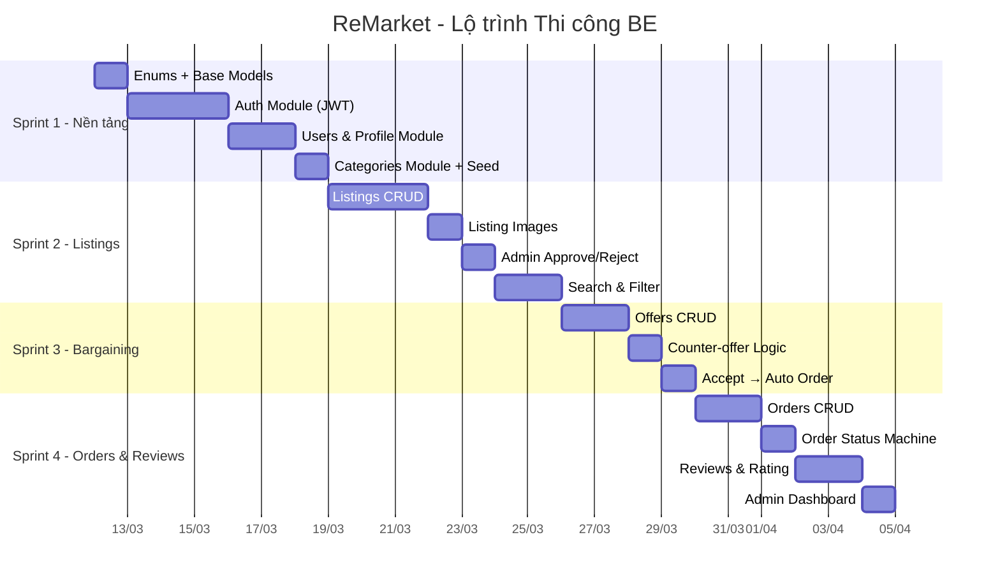

# 🚀 ReMarket — Lộ trình Thi công Chi tiết

> **Version:** 3.0 | **Ngày cập nhật:** 2026-03-14
> **Mục đích:** Hướng dẫn step-by-step để bắt tay code ngay
> **Ưu tiên:** BE trước → FE sau | MinIO, Docker → để sau

---

## Mục lục

1. [Tổng quan Lộ trình](#1-tổng-quan-lộ-trình)
2. [Cấu trúc Thư mục BE](#2-cấu-trúc-thư-mục-be)
3. [Sprint 1 — Nền tảng (Auth + Users + Categories)](#sprint-1)
4. [Sprint 2 — Listings & Images](#sprint-2)
5. [Sprint 3 — Bargaining (Offers)](#sprint-3)
6. [Sprint 4 — Orders + Reviews](#sprint-4)
7. [Checklist Tổng hợp](#7-checklist-tổng-hợp)

---

## 1. Tổng quan Lộ trình



### Quy tắc Sprint

| Quy tắc        | Chi tiết                                                      |
| -------------- | ------------------------------------------------------------- |
| **Mỗi sprint** | 5-7 ngày làm việc                                             |
| **Mỗi module** | Model → Schema → Service → Router → Test                      |
| **Ảnh upload** | Sprint 1-3: dùng local file system `/uploads/`. MinIO làm sau |
| **Test**       | Mỗi module phải có ít nhất unit test cho service layer        |
| **API docs**   | FastAPI auto-gen Swagger tại `/docs`                          |

---

## 2. Cấu trúc Thư mục Dự án

```
ReMarket/                          # Root project
├── docker-compose.yml             # Chạy BE + FE + DB cùng lúc (dev)
├── README.md
└── .gitignore

├── Backend/
│   ├── app/
│   │   ├── api/                   # Routers / Endpoints
│   │   │   ├── __init__.py
│   │   │   ├── dependencies.py    # ⭐ get_db, get_current_user, get_current_admin
│   │   │   └── v1/
│   │   │       ├── __init__.py
│   │   │       ├── auth.py
│   │   │       ├── users.py
│   │   │       ├── categories.py
│   │   │       ├── listings.py
│   │   │       ├── offers.py
│   │   │       ├── orders.py
│   │   │       ├── reviews.py
│   │   │       ├── notifications.py
│   │   │       └── admin.py
│   │   ├── core/                  # Cấu hình core
│   │   │   ├── __init__.py
│   │   │   ├── config.py          # Settings từ .env (Pydantic BaseSettings)
│   │   │   └── security.py        # JWT, bcrypt, token helpers
│   │   ├── crud/                  # Thao tác DB (CRUD functions per model)
│   │   │   ├── __init__.py
│   │   │   ├── crud_user.py
│   │   │   ├── crud_category.py
│   │   │   ├── crud_listing.py
│   │   │   ├── crud_offer.py
│   │   │   ├── crud_order.py
│   │   │   ├── crud_review.py
│   │   │   └── crud_notification.py
│   │   ├── db/                    # Database engine + session
│   │   │   ├── __init__.py
│   │   │   └── session.py         # AsyncEngine, AsyncSession, get_db
│   │   ├── models/                # SQLModel table definitions
│   │   │   ├── __init__.py
│   │   │   ├── enums.py           # ⭐ Tất cả Enum (UserRole, ListingStatus...)
│   │   │   ├── user.py
│   │   │   ├── category.py
│   │   │   ├── listing.py         # Listing + ListingImage
│   │   │   ├── offer.py
│   │   │   ├── order.py
│   │   │   ├── review.py
│   │   │   └── notification.py
│   │   ├── schemas/               # Pydantic schemas (Request/Response)
│   │   │   ├── __init__.py
│   │   │   ├── auth.py            # RegisterRequest, TokenResponse...
│   │   │   ├── user.py
│   │   │   ├── category.py
│   │   │   ├── listing.py
│   │   │   ├── offer.py
│   │   │   ├── order.py
│   │   │   ├── review.py
│   │   │   └── notification.py
│   │   └── main.py                # FastAPI app entry point
│   ├── alembic/                   # Migration files
│   │   └── versions/
│   ├── alembic.ini
│   ├── requirements.txt           # Hoặc pyproject.toml
│   ├── Dockerfile
│   └── .env

└── Frontend/
    ├── public/                    # Static assets (favicon, robots.txt...)
    ├── src/
    │   ├── assets/                # Hình ảnh, fonts, SVG
    │   ├── client/                # ⭐ API client (auto-gen bởi openapi-ts)
    │   ├── components/            # UI components dùng chung
    │   │   ├── common/            # Button, Input, Modal...
    │   │   └── layout/            # Header, Footer, Sidebar
    │   ├── hooks/                 # Custom React hooks
    │   ├── routes/                # Pages / Route components (TanStack Router)
    │   │   ├── index.tsx          # Trang chủ
    │   │   ├── _layout.tsx        # Root layout
    │   │   └── ...
    │   ├── theme/                 # Cấu hình UI theme (màu sắc, font...)
    │   ├── utils/                 # Helper functions (format tiền, ngày...)
    │   ├── routeTree.gen.ts       # Auto-generated bởi TanStack Router
    │   ├── App.tsx                # Root component
    │   └── main.tsx               # Entry point (mount App vào #root)
    ├── .env                       # VITE_API_URL=...
    ├── Dockerfile                 # Multi-stage: build → Nginx serve
    ├── .gitignore
    ├── index.html
    ├── nginx.conf                 # Nginx config cho production
    ├── openapi-ts.config.ts       # Config generate API client
    ├── package.json
    ├── tsconfig.json
    └── vite.config.ts
```

> [!NOTE]
> - **BE không dùng `docker-compose` trực tiếp** — chỉ dùng `Dockerfile` riêng. `docker-compose.yml` ở root chỉ để orchestrate cả cụm.
> - **FE chạy dev** bằng `npm run dev` (Vite dev server). `Dockerfile` + `nginx.conf` chỉ dùng khi build production.
> - **`crud/`** chứa pure DB operations (không có business logic). Business logic nằm trong các API route handlers.
> - **`client/`** trong FE được auto-generate từ OpenAPI spec: `npx openapi-ts` → không sửa tay.


---

## Sprint 1

### 🎯 Mục tiêu: Auth (JWT) + Users & Profile + Categories

### Task 1.1: Setup Project + Base

**Thời gian:** 0.5 ngày

- [ ] Khởi tạo project FastAPI (nếu chưa có)
- [ ] Cấu hình `app/core/config.py` (DATABASE_URL, SECRET_KEY, JWT settings)
- [ ] Cấu hình `app/db/session.py` (async SQLAlchemy engine + sessionmaker)
- [ ] Tạo `app/models/enums.py` — tất cả Enum classes

```python
# app/core/config.py
class Settings(BaseSettings):
    DATABASE_URL: str
    SECRET_KEY: str
    ACCESS_TOKEN_EXPIRE_MINUTES: int = 30
    REFRESH_TOKEN_EXPIRE_DAYS: int = 7
    ALGORITHM: str = "HS256"

    model_config = SettingsConfigDict(env_file=".env")

settings = Settings()
```

```python
# app/db/session.py
from sqlalchemy.ext.asyncio import create_async_engine, AsyncSession
from sqlalchemy.orm import sessionmaker
from app.core.config import settings

engine = create_async_engine(settings.DATABASE_URL)
AsyncSessionLocal = sessionmaker(engine, class_=AsyncSession, expire_on_commit=False)

async def get_db():
    async with AsyncSessionLocal() as session:
        yield session
```

```python
# app/models/enums.py — copy từ 01-database-design.md
# UserRole, ListingStatus, ConditionGrade, OfferStatus, OrderStatus
```

### Task 1.2: Auth Module

**Thời gian:** 3 ngày

**Step 1: Model**

- [ ] `app/models/user.py` — class `User(SQLModel, table=True)`

```python
# models/user.py — Key fields
class User(SQLModel, table=True):
    __tablename__ = "users"
    id: uuid.UUID = Field(default_factory=uuid.uuid4, primary_key=True)
    email: str = Field(max_length=255, unique=True, index=True)
    phone: Optional[str] = Field(max_length=20, default=None)
    password_hash: str = Field(max_length=255)
    full_name: str = Field(max_length=255)
    avatar_url: Optional[str] = None
    bio: Optional[str] = None
    province: Optional[str] = Field(max_length=100, default=None)
    district: Optional[str] = Field(max_length=100, default=None)
    ward: Optional[str] = Field(max_length=100, default=None)
    address_detail: Optional[str] = Field(max_length=255, default=None)
    is_phone_verified: bool = Field(default=False)
    is_email_verified: bool = Field(default=False)
    trust_score: Decimal = Field(default=Decimal("0.0"))
    rating_avg: Decimal = Field(default=Decimal("0.00"))
    rating_count: int = Field(default=0)
    completed_orders: int = Field(default=0)
    role: UserRole = Field(default=UserRole.USER)
    is_active: bool = Field(default=True)
    hashed_refresh_token: Optional[str] = Field(max_length=255, default=None)
    created_at: datetime = Field(default_factory=datetime.utcnow)
    updated_at: datetime = Field(default_factory=datetime.utcnow)
```

**Step 2: Schemas**

- [ ] `app/schemas/auth.py`

```python
# schemas/auth.py
class RegisterRequest(BaseModel):
    email: EmailStr
    password: str = Field(min_length=8)
    full_name: str = Field(min_length=2, max_length=255)
    phone: Optional[str] = None

class LoginRequest(BaseModel):
    email: EmailStr
    password: str

class TokenResponse(BaseModel):
    access_token: str
    refresh_token: str
    token_type: str = "bearer"
    user: UserPublicResponse

class RefreshRequest(BaseModel):
    refresh_token: str
```

**Step 3: Security**

- [ ] `app/core/security.py` — password hash (bcrypt), JWT encode/decode

```python
# core/security.py — Functions to implement
def hash_password(password: str) -> str: ...
def verify_password(plain: str, hashed: str) -> bool: ...
def create_access_token(user_id: str, role: str) -> str: ...
def create_refresh_token() -> str: ...  # random 32 bytes → hex
def hash_token(token: str) -> str: ...  # SHA-256
def decode_access_token(token: str) -> dict: ...
```

**Step 4: Dependencies**

- [ ] `app/api/dependencies.py` — `get_db()`, `get_current_user()`, `get_current_admin()`

```python
# app/api/dependencies.py
async def get_current_user(token: str = Depends(oauth2_scheme), db = Depends(get_db)) -> User: ...
async def get_current_admin(user: User = Depends(get_current_user)) -> User:
    if user.role != UserRole.ADMIN:
        raise HTTPException(403, "Admin access required")
    return user
```

**Step 5: CRUD + Router**

- [ ] `app/crud/crud_user.py` — pure DB operations
- [ ] `app/api/v1/auth.py` — business logic inline hoặc gọi crud

```python
# app/crud/crud_user.py
async def get_user_by_email(db: AsyncSession, email: str) -> User | None:
    result = await db.execute(select(User).where(User.email == email))
    return result.scalar_one_or_none()

async def create_user(db: AsyncSession, data: RegisterRequest) -> User:
    user = User(**data.model_dump(exclude={"password"}),
                password_hash=hash_password(data.password))
    db.add(user)
    await db.commit()
    await db.refresh(user)
    return user

async def update_refresh_token(db: AsyncSession, user_id, hashed_token: str | None):
    await db.execute(update(User)
        .where(User.id == user_id)
        .values(hashed_refresh_token=hashed_token))
    await db.commit()
```

```python
# app/api/v1/auth.py
router = APIRouter(prefix="/auth", tags=["Auth"])

@router.post("/register", status_code=201, response_model=TokenResponse)
async def register(data: RegisterRequest, db = Depends(get_db)):
    # 1. Check email unique
    # 2. crud.create_user(db, data)
    # 3. Generate tokens + UPDATE hashed_refresh_token
    ...

@router.post("/login", response_model=TokenResponse)
@router.post("/refresh", response_model=TokenResponse)
@router.post("/logout", status_code=204)
```

**Step 7: Test**

- [ ] Test đăng ký thành công
- [ ] Test đăng ký email trùng → 409
- [ ] Test đăng nhập đúng/sai
- [ ] Test refresh token (rotation)
- [ ] Test logout → token vô hiệu

---

### Task 1.3: Users & Profile Module

**Thời gian:** 2 ngày

- [ ] `app/schemas/user.py` — `UserUpdate`, `UserPublicProfile`, `UserMe`
- [ ] `app/crud/crud_user.py` — thêm update_user(), get_user_by_id()
- [ ] `app/api/v1/users.py`

```python
# schemas/user.py
class UserUpdate(BaseModel):
    full_name: Optional[str] = None
    phone: Optional[str] = None
    avatar_url: Optional[str] = None
    bio: Optional[str] = None
    province: Optional[str] = None
    district: Optional[str] = None
    ward: Optional[str] = None
    address_detail: Optional[str] = None

class UserPublicProfile(BaseModel):
    id: uuid.UUID
    full_name: str
    avatar_url: Optional[str]
    bio: Optional[str]
    trust_score: float
    rating_avg: float
    rating_count: int
    completed_orders: int
    created_at: datetime
```

**API cần implement:**

| Method | Endpoint                    | Mô tả          |
| ------ | --------------------------- | -------------- |
| GET    | `/api/v1/users/me`          | Lấy profile    |
| PUT    | `/api/v1/users/me`          | Cập nhật       |
| GET    | `/api/v1/users/:id/profile` | Profile public |

---

### Task 1.4: Categories Module

**Thời gian:** 1 ngày

- [ ] `app/models/category.py` — class `Category`
- [ ] `app/schemas/category.py` — `CategoryCreate`, `CategoryTree`
- [ ] `app/crud/crud_category.py`
- [ ] `app/api/v1/categories.py`
- [ ] Script seed data (8 danh mục cấp 1 + con)

```python
# models/category.py
class Category(SQLModel, table=True):
    __tablename__ = "categories"
    id: uuid.UUID = Field(default_factory=uuid.uuid4, primary_key=True)
    parent_id: Optional[uuid.UUID] = Field(default=None, foreign_key="categories.id")
    name: str = Field(max_length=255)
    slug: str = Field(max_length=255, unique=True)
    icon_url: Optional[str] = None
    created_at: datetime = Field(default_factory=datetime.utcnow)

# services/category_service.py — Key method
class CategoryService:
    async def get_tree(self, db) -> list[CategoryTree]:
        """Lấy danh mục cấp 1 + children gom thành cây."""
        ...

    async def create(self, db, data: CategoryCreate) -> Category:
        """Admin tạo danh mục. Auto-gen slug."""
        ...
```

---

## Sprint 2

### 🎯 Mục tiêu: Listings CRUD + Images + Admin + Search

### Task 2.1: Listing Model & CRUD

**Thời gian:** 3 ngày

- [ ] `models/listing.py` — class `Listing`, `ListingImage`
- [ ] `schemas/listing.py` — `ListingCreate`, `ListingUpdate`, `ListingDetail`, `ListingFilter`, `ListingBrief`
- [ ] `services/listing_service.py`
- [ ] `api/v1/listings.py`

```python
# models/listing.py
class Listing(SQLModel, table=True):
    __tablename__ = "listings"
    id: uuid.UUID = Field(default_factory=uuid.uuid4, primary_key=True)
    seller_id: uuid.UUID = Field(foreign_key="users.id")
    category_id: uuid.UUID = Field(foreign_key="categories.id")
    title: str = Field(max_length=500)
    description: Optional[str] = None
    price: Decimal = Field(decimal_places=2)
    is_negotiable: bool = Field(default=True)
    condition_grade: ConditionGrade
    status: ListingStatus = Field(default=ListingStatus.PENDING)
    created_at: datetime = Field(default_factory=datetime.utcnow)
    updated_at: datetime = Field(default_factory=datetime.utcnow)

class ListingImage(SQLModel, table=True):
    __tablename__ = "listing_images"
    id: uuid.UUID = Field(default_factory=uuid.uuid4, primary_key=True)
    listing_id: uuid.UUID = Field(foreign_key="listings.id")
    image_url: str
    is_primary: bool = Field(default=False)
    created_at: datetime = Field(default_factory=datetime.utcnow)
```

```python
# schemas/listing.py — Request
class ListingCreate(BaseModel):
    title: str = Field(min_length=5, max_length=500)
    category_id: uuid.UUID
    price: Decimal = Field(ge=0)
    is_negotiable: bool = True
    condition_grade: ConditionGrade
    description: Optional[str] = None

# schemas/listing.py — Filter (query params)
class ListingFilter(BaseModel):
    search: Optional[str] = None
    category_id: Optional[uuid.UUID] = None
    condition_grade: Optional[ConditionGrade] = None
    price_min: Optional[Decimal] = None
    price_max: Optional[Decimal] = None
    province: Optional[str] = None
    sort_by: str = "created_at"  # created_at | price
    sort_order: str = "desc"
    page: int = 1
    page_size: int = 20
```

**CRUD + Service Logic cần chú ý:**

```python
# app/crud/crud_listing.py
async def create_listing(db, seller_id, data: ListingCreate) -> Listing:
    # 1. INSERT listing (status='pending')
    # 2. INSERT images (cảnh đầu tiên is_primary=True)
    ...

async def list_with_filter(db, filters: ListingFilter) -> PaginatedResult:
    # Full-text search nếu có `search` (GIN index)
    # Filter: category, condition, price range, province
    # Only status='active'
    # Paginate
    ...
```

### Task 2.2: Listing Images Upload

**Thời gian:** 1 ngày

- [ ] Endpoint upload ảnh (tạm dùng local `/uploads/`)
- [ ] Validate: ≥ 1 ảnh
- [ ] Set `is_primary` cho ảnh đầu tiên

```python
# api/v1/listings.py — Upload flow
@router.post("/{listing_id}/images")
async def upload_images(
    listing_id: uuid.UUID,
    images: list[UploadFile],
    db = Depends(get_db),
    user = Depends(get_current_user)
):
    # Save files to /uploads/listings/{listing_id}/
    # INSERT listing_images records
    ...
```

> [!NOTE]
> **Tạm thời dùng local file system.** Khi triển khai MinIO/S3 sau, chỉ cần thay đổi hàm `save_file()` trong `crud/crud_listing.py`, không ảnh hưởng API.

### Task 2.3: Admin Approve/Reject Listings

**Thời gian:** 1 ngày

- [ ] `api/v1/admin.py` — endpoints admin
- [ ] `GET /admin/listings/pending` — danh sách chờ duyệt
- [ ] `POST /admin/listings/:id/approve` — duyệt → active
- [ ] `POST /admin/listings/:id/reject` — từ chối + lý do

### Task 2.4: Search & Filter

**Thời gian:** 2 ngày

- [ ] Full-text search (PostgreSQL `to_tsvector` + `to_tsquery`)
- [ ] Multi-field filter trong `app/crud/crud_listing.py`
- [ ] Pagination helper (inline trong crud hoặc `app/utils/pagination.py`)
- [ ] Sort by: newest, price_asc, price_desc

```python
# utils/pagination.py
class PaginatedResult(BaseModel, Generic[T]):
    items: list[T]
    total: int
    page: int
    page_size: int
    total_pages: int
```

---

## Sprint 3

### 🎯 Mục tiêu: Bargaining Module (Offers)

### Task 3.1: Offer Model & CRUD

**Thời gian:** 2 ngày

- [ ] `app/models/offer.py` — class `Offer`
- [ ] `app/schemas/offer.py` — `OfferCreate`, `CounterOfferCreate`, `OfferResponse`
- [ ] `app/crud/crud_offer.py`
- [ ] `app/api/v1/offers.py`

```python
# models/offer.py
class Offer(SQLModel, table=True):
    __tablename__ = "offers"
    id: uuid.UUID = Field(default_factory=uuid.uuid4, primary_key=True)
    listing_id: uuid.UUID = Field(foreign_key="listings.id")
    buyer_id: uuid.UUID = Field(foreign_key="users.id")
    offer_price: Decimal = Field(decimal_places=2)
    status: OfferStatus = Field(default=OfferStatus.PENDING)
    created_at: datetime = Field(default_factory=datetime.utcnow)
    updated_at: datetime = Field(default_factory=datetime.utcnow)
```

```python
# app/crud/crud_offer.py — Core functions
async def create_offer(db, buyer_id, data: OfferCreate) -> Offer:
    """
    Validate:
        Validate:
        1. Listing active + is_negotiable
        2. buyer != seller
        3. INSERT offer (status='pending')
        """
        ...

    async def counter_offer(self, db, seller_id, offer_id, data: CounterOfferCreate) -> Offer:
        """
        1. SELECT offer WHERE id AND seller_id (via listing) AND status='pending'
        2. UPDATE offer SET status='countered'
        3. INSERT new offer (offer_price=counter_price, status='pending')
        """
        ...

    async def accept_offer(self, db, user_id, offer_id) -> tuple[Offer, Order]:
        """
        DB Transaction:
        1. UPDATE offer status='accepted'
        2. UPDATE all other offers on same listing → 'rejected'
        3. INSERT order (final_price=offer_price, status='pending')
        """
        ...

    async def reject_offer(self, db, user_id, offer_id) -> Offer:
        """UPDATE offer status='rejected'"""
        ...

    async def get_my_offers(self, db, user_id, role: str) -> list[Offer]:
        """role = 'sent' (buyer) hoặc 'received' (seller)"""
        ...
```

---

## Sprint 4

### 🎯 Mục tiêu: Orders + Reviews + Admin Dashboard

### Task 4.1: Order Model & CRUD

**Thời gian:** 2 ngày

- [ ] `app/models/order.py` — class `Order`
- [ ] `app/schemas/order.py` — `OrderCreate`, `OrderDetail`
- [ ] `app/crud/crud_order.py`
- [ ] `app/api/v1/orders.py`

```python
# models/order.py
class Order(SQLModel, table=True):
    __tablename__ = "orders"
    id: uuid.UUID = Field(default_factory=uuid.uuid4, primary_key=True)
    buyer_id: uuid.UUID = Field(foreign_key="users.id")
    seller_id: uuid.UUID = Field(foreign_key="users.id")
    listing_id: uuid.UUID = Field(foreign_key="listings.id")
    final_price: Decimal = Field(decimal_places=2)
    status: OrderStatus = Field(default=OrderStatus.PENDING)
    created_at: datetime = Field(default_factory=datetime.utcnow)
    updated_at: datetime = Field(default_factory=datetime.utcnow)
```

```python
# app/crud/crud_order.py
VALID_TRANSITIONS = {
    OrderStatus.PENDING: [OrderStatus.COMPLETED, OrderStatus.CANCELLED],
}

async def create_order(db, buyer_id, listing_id) -> Order:
        """
        1. Validate listing active, buyer != seller
        2. INSERT order (final_price=listing.price, status='pending')
        3. UPDATE listing SET status='sold'
        """
        ...

    async def complete_order(db, buyer_id, order_id) -> Order:
        """
        1. Validate order.buyer_id == buyer_id AND status='pending'
        2. UPDATE order status='completed'
        3. UPDATE users.completed_orders += 1 (seller)
        """
        ...

    async def cancel_order(db, user_id, order_id) -> Order:
        """
        1. Validate caller is buyer or seller, status='pending'
        2. UPDATE order status='cancelled'
        3. UPDATE listing status='active' (reactivate)
        """
        ...
```

**Endpoints:**

| Method | Endpoint                       | Ai gọi       | Transition           |
| ------ | ------------------------------ | ------------ | -------------------- |
| POST   | `/orders`                      | Buyer        | → pending            |
| POST   | `/orders/:id/complete`         | Buyer        | pending → completed  |
| POST   | `/orders/:id/cancel`           | Buyer/Seller | pending → cancelled  |

### Task 4.2: Reviews & Rating

**Thời gian:** 2 ngày

- [ ] `app/models/review.py` — class `Review`
- [ ] `app/schemas/review.py`
- [ ] `app/crud/crud_review.py`
- [ ] Update trust_score sau mỗi review

```python
# models/review.py
class Review(SQLModel, table=True):
    __tablename__ = "reviews"
    id: uuid.UUID = Field(default_factory=uuid.uuid4, primary_key=True)
    order_id: uuid.UUID = Field(foreign_key="orders.id", unique=True)
    reviewer_id: uuid.UUID = Field(foreign_key="users.id")
    reviewee_id: uuid.UUID = Field(foreign_key="users.id")
    rating: int = Field(ge=1, le=5)
    comment: Optional[str] = None
    created_at: datetime = Field(default_factory=datetime.utcnow)
```

```python
# app/crud/crud_review.py
async def create_review(db, reviewer_id, data: ReviewCreate) -> Review:
        # 1. Validate order completed + reviewer = buyer
        # 2. Check chưa review (order_id UNIQUE)
        # 3. INSERT review
        # 4. Recalculate seller stats:
        #    rating_count += 1
        #    rating_avg = (old_avg * old_count + new_rating) / new_count
        # 5. Recalculate trust_score
        ...

def _calculate_trust_score(user: User) -> float:
        score = (user.completed_orders * 2)
        score += (float(user.rating_avg) * 10)
        account_age = (datetime.utcnow() - user.created_at).days / 30
        score += min(account_age, 12)
        return round(score, 1)
```

### Task 4.3: Admin Dashboard

**Thời gian:** 1 ngày

- [ ] `GET /api/v1/admin/dashboard` — thống kê tổng hợp
- [ ] `GET /api/v1/admin/users` — quản lý users
- [ ] `POST /api/v1/admin/users/:id/ban` — ban user

```python
# Dashboard stats
class DashboardStats(BaseModel):
    total_users: int
    total_listings: int
    active_listings: int
    pending_listings: int
    total_orders: int
    completed_orders: int
    cancelled_orders: int
    total_revenue: Decimal  # Tổng final_price các order completed
```

---

### Task 4.4: Notifications Module

**Thời gian:** 1 ngày

- [ ] `app/models/notification.py` — class `Notification`
- [ ] `app/schemas/notification.py` — `NotificationResponse`
- [ ] `app/crud/crud_notification.py` — static helper dùng khắp nơi
- [ ] `app/api/v1/notifications.py` — endpoints read/list
- [ ] Tích hợp gọi `create_notification()` vào: `crud_offer`, `crud_order`, `crud_listing`, `crud_review`

```python
# models/notification.py
class Notification(SQLModel, table=True):
    __tablename__ = "notifications"
    id: uuid.UUID = Field(default_factory=uuid.uuid4, primary_key=True)
    user_id: uuid.UUID = Field(foreign_key="users.id")
    type: str = Field(max_length=50)
    title: str = Field(max_length=255)
    message: str
    data: dict = Field(default_factory=dict, sa_column=Column(JSONB))
    is_read: bool = Field(default=False)
    created_at: datetime = Field(default_factory=datetime.utcnow)
```

```python
# app/crud/crud_notification.py
async def create(db, user_id, type, title, message, data={}) -> Notification:
    notif = Notification(user_id=user_id, type=type, title=title, message=message, data=data)
    db.add(notif)
    return notif  # commit do caller đảm nhận

async def mark_read(db, notif_id, user_id) -> None:
    await db.execute(update(Notification)
        .where(Notification.id == notif_id, Notification.user_id == user_id)
        .values(is_read=True))

async def mark_all_read(db, user_id) -> None:
    await db.execute(update(Notification)
        .where(Notification.user_id == user_id, Notification.is_read == False)
        .values(is_read=True))

async def get_unread_count(db, user_id) -> int:
    result = await db.execute(
        select(func.count()).where(
            Notification.user_id == user_id, Notification.is_read == False)
    )
    return result.scalar()
```

**Ví dụ tích hợp (trong crud_offer):**

```python
# app/crud/crud_offer.py — sau khi INSERT offer
await create(
    db,
    user_id=listing.seller_id,
    type="offer_received",
    title="Bạn có giá trả mới",
    message=f"Offer {offer.offer_price:,.0f} VND cho tin '{listing.title}'",
    data={"offer_id": str(offer.id), "listing_id": str(listing.id)}
)
```

---

## 7. Checklist Tổng hợp

### BE Checklist

| Sprint | Module          | Model | Schema | Service | Router | Test | ✅  |
| ------ | --------------- | :---: | :----: | :-----: | :----: | :--: | :-: |
| 1      | Enums           |  ☐    |   —    |    —    |   —    |  —   |  ☐  |
| 1      | Auth            |  ☐    |   ☐    |    ☐    |   ☐    |  ☐   |  ☐  |
| 1      | Users & Profile |  ☐    |   ☐    |    ☐    |   ☐    |  ☐   |  ☐  |
| 1      | Categories      |  ☐    |   ☐    |    ☐    |   ☐    |  ☐   |  ☐  |
| 2      | Listings        |  ☐    |   ☐    |    ☐    |   ☐    |  ☐   |  ☐  |
| 2      | Listing Images  |  ☐    |   ☐    |    ☐    |   ☐    |  ☐   |  ☐  |
| 2      | Admin Listings  |   —   |   —    |    ☐    |   ☐    |  ☐   |  ☐  |
| 2      | Search & Filter |   —   |   ☐    |    ☐    |   ☐    |  ☐   |  ☐  |
| 3      | Offers          |  ☐    |   ☐    |    ☐    |   ☐    |  ☐   |  ☐  |
| 3      | Counter-offer   |   —   |   ☐    |    ☐    |   ☐    |  ☐   |  ☐  |
| 3      | Accept → Order  |   —   |   —    |    ☐    |   ☐    |  ☐   |  ☐  |
| 4      | Orders          |  ☐    |   ☐    |    ☐    |   ☐    |  ☐   |  ☐  |
| 4      | Reviews         |  ☐    |   ☐    |    ☐    |   ☐    |  ☐   |  ☐  |
| 4      | Notifications   |  ☐    |   ☐    |    ☐    |   ☐    |  ☐   |  ☐  |
| 4      | Admin Dashboard |   —   |   ☐    |    ☐    |   ☐    |  ☐   |  ☐  |

### Để làm SAU (không thuộc sprint trên)

| Hạng mục                | Ghi chú                                       |
| ----------------------- | --------------------------------------------- |
| MinIO / S3              | Thay thế local upload → object storage        |
| Docker + Docker Compose | Container hóa (FastAPI + PostgreSQL + Redis)  |
| Redis Cache             | Cache categories, listing detail              |
| PostGIS + Hyperlocal    | Nếu cần tìm kiếm theo GPS                    |
| WebSocket               | Realtime notifications                        |
| Frontend React          | Sau khi BE API ổn định                        |
| CI/CD                   | GitHub Actions                                |
| Escrow / Demo Wallet    | Virtual escrow flow only                      |
| KYC                     | Xác thực danh tính                            |
| Rate Limiting           | Per-IP, per-user                              |
| Logging & Monitoring    | Structured logging, Sentry                    |

---

> **Tài liệu liên quan:**
>
> - `01-database-design.md` — Thiết kế Database chi tiết
> - `02-module-design.md` — Thiết kế Module chi tiết
